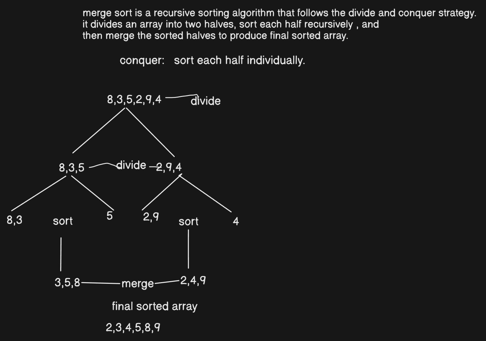
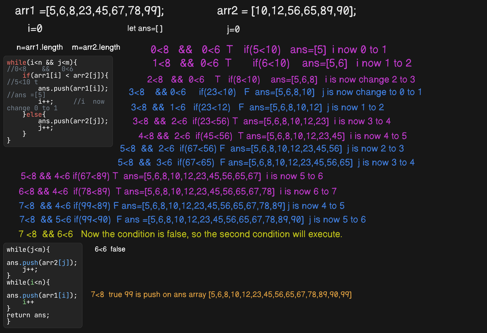
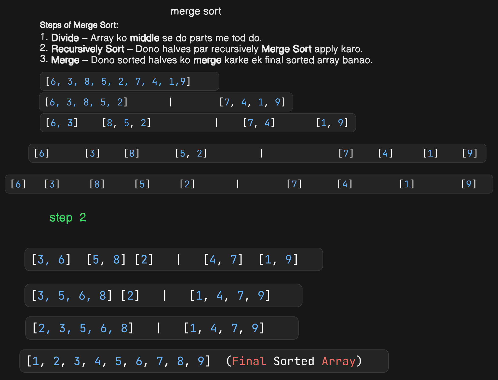

#  DSA Practice with JavaScript  

## 📌 About This Repository  
- 📂 **Contains:** My solutions to DSA problems in JavaScript  
- 🎯 **Goal:** Improve problem-solving skills and master algorithms  
-  **Topics Covered:** Arrays, Linked Lists, Stacks, Queues, Trees, Graphs, Dynamic Programming, Sorting & Searching, and more  

